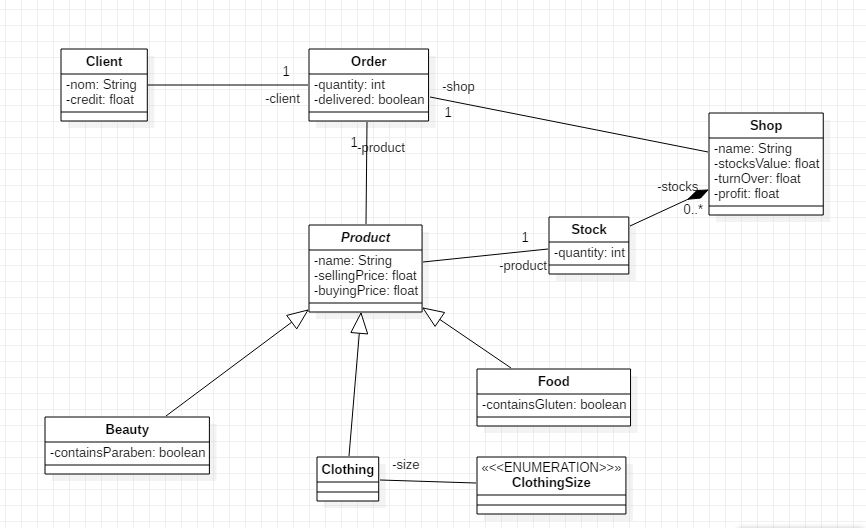

# Shop : exemple à faire évoluer autour du pattern repository et des couches model et accès aux données (DAO)

Ce projet aborde les sujets suivants:

* Le passage d’un modèle de classe UML basique (en bas de page) vers des classes java
* La sérialisation et l’utilisation d’un fichier de configuration
* Découvrir le pattern repository et commencer à faire persister des objets dans des fichiers pour le faire plus tard dans des bases de données relationnelles (ex Mysql avec JDBC ou JPA) ou pas (ex Nosql avec Mongodb)
* Une façon d’organiser une application en couche  
* Des Tests avec Junit

## Ce que vous devrez faire et me rendre chacun un document écrit qui réponds à ces interrogations

* Analyser la structure du projet et la comprendre
* M'expliquer à quoi sert la classe Entity
* Comprendre la serialization et l'utilisation du fichier de configuration
* Lire et comprendre les liens en bas de page pour mieux cerner le pattern repository et l'architecture hexagonale
* Implémenter les méthodes de calculs manquantes dans Shop
* Comprendre ce que je fais avec la TestUtils
* Terminer les interfaces et les implémentations des repositories manquants .
* Créer les test suivants : pour la partie model seulement les calculs de Shop, un petit scenario qui mèle un peu toutes les classes. Et pour les parties stockage montrez que tout marche bien et que çà génère des excptions en cas de suppresion accidentelle de fichiers.

### Ce qui suivra

* Passage du stockage das des fichiers vers Mysql une fois le cours SQL démarré
* Ajout d'un diagramme de cas d'utilisations pour concervoir la couche de service d'application
* le déploiement de ce projet vers un librairie pour l'intégrer plus tard dans un projet d'API REST avec Spring Boot

## Liens (très importants à lire !!!)

[Arch Hexagonale](https://martinfowler.com/bliki/PresentationDomainDataLayering.html)

[Pattern repo](https://martinfowler.com/eaaCatalog/repository.html)

[Hexago en FR](https://blog.xebia.fr/2016/03/16/perennisez-votre-metier-avec-larchitecture-hexagonale/)

[repo again](https://thinkinginobjects.com/2012/08/26/dont-use-dao-use-repository/)

